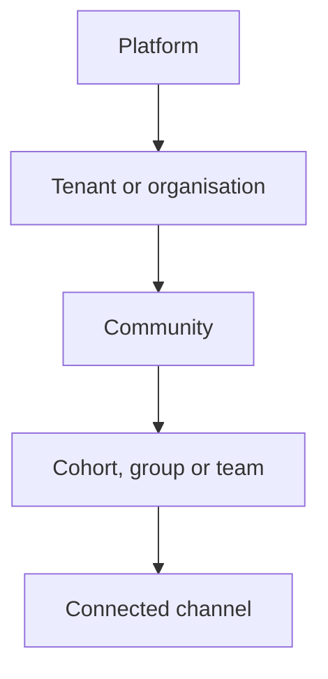
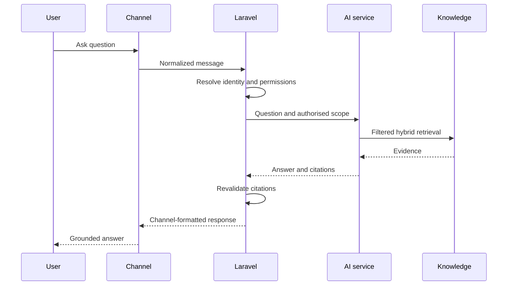
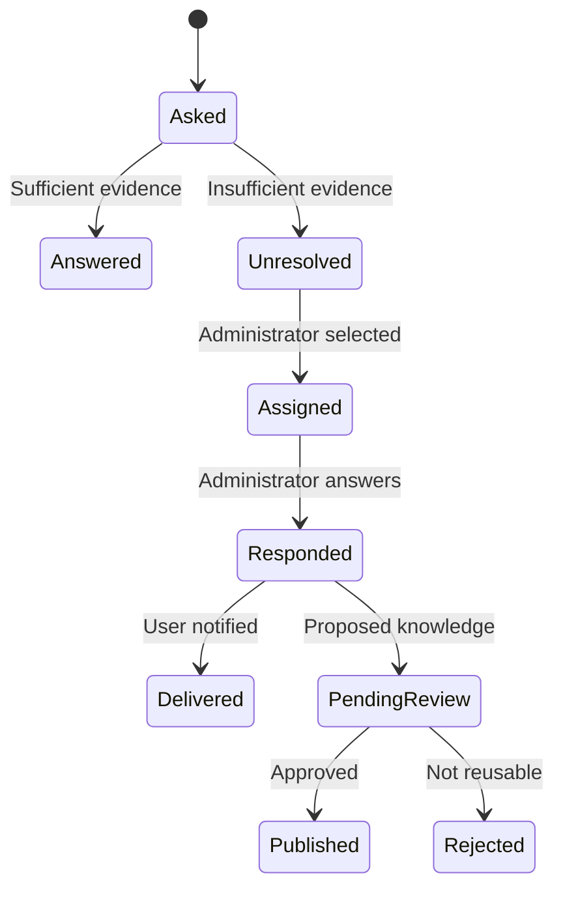
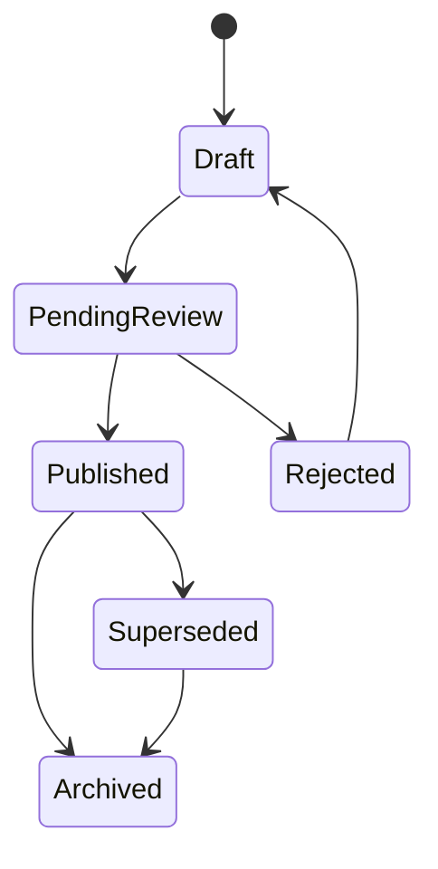
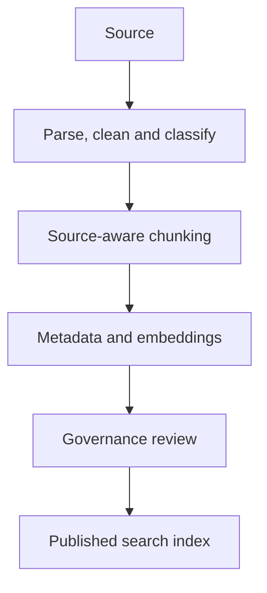

# Product Requirements Document

## Community AI Assistant

**Document status:** Working PRD  
**Initial deployment:** METI UniPods AI Innovation Programme  
**Product model:** Multi-tenant SaaS  
**Initial channels:** Web PWA, WhatsApp private assistant, Slack  
**Future channels:** Telegram, Discord, Microsoft Teams, Messenger, Instagram, email, SMS and custom integrations  

---

# 1. Product summary

Community AI Assistant is a multilingual, multi-tenant knowledge and communication platform that converts fragmented community information—chats, documents, meetings, announcements and administrator answers—into a governed, searchable community memory.

Members can ask questions in their preferred communication channel and receive grounded answers with citations. They can also request summaries of what they missed.

Administrators receive tools for managing sources, reviewing AI-generated knowledge, answering unresolved questions, publishing official information and monitoring answer quality.

The first implementation targets METI UniPods, but the product must support multiple independent organisations, communities and cohorts without mixing their information.

The product is not merely a generic chatbot. Its primary value is:

> Helping communities preserve, govern and retrieve important information across conversations, meetings and documents.

---

# 2. Problem statement

Large communities generate information across:

* WhatsApp groups
* Slack workspaces
* meetings and calls
* documents
* voice notes
* announcements
* informal questions and answers
* direct messages
* external links

As message volume increases:

* members miss important announcements;
* questions are repeatedly asked;
* answers become buried in chat history;
* people who miss meetings cannot easily catch up;
* unofficial answers may be mistaken for official information;
* old information remains available after policies change;
* administrators repeatedly answer the same questions;
* information is scattered across unrelated platforms;
* members may receive answers from communities they should not access.

A searchable chat archive alone does not solve these problems. The product must understand authority, access, dates, source versions and whether information is still valid.

---

# 3. Product vision

Create a trusted AI community memory that follows each organisation across its chosen communication platforms.

The system should let a member ask:

* “What happened in yesterday’s meeting?”
* “What is the application deadline?”
* “What did I miss this week?”
* “Has the venue changed?”
* “What decisions were made about the project?”
* “What tasks were assigned to me?”
* “Where is the official registration link?”
* “What questions are still unresolved?”

The assistant must:

1. search only information the user is permitted to access;
2. distinguish official and informal information;
3. prefer current information over superseded information;
4. cite the messages, documents or meeting timestamps supporting its response;
5. say when it does not know;
6. escalate unanswered questions to an administrator;
7. respond in the user’s preferred language where possible.

---

# 4. Product principles

## 4.1 Grounded answers

The assistant must answer from approved community information, not general model memory, unless the interface explicitly labels an external or general-knowledge answer.

## 4.2 Permission before retrieval

Access control must be applied before retrieving knowledge. It must not depend only on instructions given to the language model.

## 4.3 Sources over confidence

Every factual answer should include its supporting sources. A confident answer without evidence is not acceptable.

## 4.4 Human authority

Administrators and trusted organisers remain responsible for official information. AI helps process and retrieve it but does not make community policy.

## 4.5 Honest uncertainty

When supporting information is insufficient or conflicting, the assistant must explain that and escalate when appropriate.

## 4.6 Channel independence

WhatsApp, Slack and the web interface are delivery channels. Business logic and community knowledge must remain independent of any particular platform.

## 4.7 Multilingual by design

Language detection, multilingual search, translation, right-to-left display and community glossaries must be architectural capabilities—not later interface patches.

## 4.8 Auditable operations

Important administrative and AI operations must be traceable to a user, source, time and resulting change.

---

# 5. Target users

## 5.1 Community member

A member wants to:

* ask questions;
* receive answers with sources;
* catch up on missed activity;
* search community knowledge;
* receive relevant announcements;
* see assigned tasks;
* change language preferences;
* escalate unresolved questions.

## 5.2 Community administrator

An administrator wants to:

* connect communication platforms;
* upload documents and chat exports;
* manage members and permissions;
* identify official organisers;
* review unresolved questions;
* publish verified answers;
* correct transcripts;
* approve meeting decisions;
* remove sensitive information;
* monitor ingestion and answer quality.

## 5.3 Trusted organiser

A trusted organiser can:

* post official announcements;
* answer escalated questions;
* verify extracted knowledge;
* mark information as outdated;
* approve meeting decisions, depending on permission.

## 5.4 Tenant owner

The owner manages the organisation-level account:

* organisation settings;
* communities and cohorts;
* integrations;
* administrators;
* AI configuration;
* usage limits;
* retention policies;
* security and audit settings.

## 5.5 Platform operator

The SaaS operator can:

* manage tenants;
* investigate platform failures;
* monitor aggregate infrastructure health;
* manage feature flags;
* handle abuse and support requests.

Platform operators must not casually browse tenant content. Any authorised support access must be limited and audited.

---

# 6. Multi-tenant organisation model



Example:

```text
Platform
└── METI
    ├── UniPods
    │   ├── Cohort 1
    │   └── Cohort 2
    └── Another Programme
```

A user may belong to:

* one tenant and one community;
* one tenant and multiple communities;
* multiple tenants;
* multiple groups with different roles.

Every applicable database record must contain a `tenant_id`. Knowledge-bearing records should also contain `community_id` and, when necessary, `group_id`.

---

# 7. Access-control requirements

The bot must answer only from communities the requesting user can access.

The access flow must be:

1. identify the external user;
2. resolve their internal account;
3. identify the active tenant/community;
4. calculate permitted communities, groups and sources;
5. apply these permissions inside the retrieval query;
6. generate an answer only from returned evidence;
7. revalidate citations before delivering the response.

If a user belongs to multiple communities:

* use the active community when known;
* otherwise search authorised communities;
* label every source with its community;
* ask the user to clarify if the question is ambiguous.

The system must test against cross-tenant and cross-community data leakage.

---

# 8. Initial product scope

## 8.1 Included in the first complete release

* Next.js PWA
* Laravel REST API
* Python FastAPI AI service
* multi-tenant organisations and communities
* authentication and role-based access
* private WhatsApp assistant
* Slack integration
* web chatbot
* channel-adapter architecture
* document upload and ingestion
* WhatsApp chat-export ingestion
* Slack message ingestion where authorised
* meeting transcript ingestion
* automatic meeting-artifact ingestion where supported
* hybrid RAG retrieval
* citations
* catch-up summaries
* multilingual questions and answers
* official announcements
* unanswered-question escalation
* knowledge approval lifecycle
* admin dashboard
* AI Admin Copilot
* deterministic product tours
* audit trail
* polling-based updates
* usage and answer-quality analytics
* OpenAPI documentation
* Docker-based development and deployment

## 8.2 Not required in the initial release

* unrestricted WhatsApp group-history access;
* unofficial WhatsApp Web automation;
* self-hosted large language models;
* complete autonomous knowledge publication;
* every future channel integration;
* Laravel Reverb/WebSocket infrastructure;
* Cloudinary plus local storage simultaneously;
* advanced billing;
* native mobile applications;
* custom meeting bot infrastructure for every meeting provider.

---

# 9. Channel strategy

The architecture must distinguish between:

* **Interaction channels:** where users ask questions and receive responses.
* **Knowledge sources:** where the system obtains information.

A platform can be both.

| Platform  | Interaction channel |                                 Knowledge source |
| --------- | ------------------: | -----------------------------------------------: |
| Web PWA   |                 Yes |                                    Admin uploads |
| WhatsApp  |                 Yes | Forwarded messages, exports and supported events |
| Slack     |                 Yes |                  Authorised channels and threads |
| Meetings  |          Usually no |            Transcripts, recordings and summaries |
| Documents |                  No |                  Uploaded or connected documents |
| Telegram  |              Future |                                           Future |
| Discord   |              Future |                                           Future |
| Teams     |              Future |                                           Future |

## 9.1 Channel adapter contract

Every integration should implement a common contract:

```text
ChannelAdapter
├── verifyWebhook()
├── identifyUser()
├── normalizeIncomingMessage()
├── sendMessage()
├── sendNotification()
├── fetchPermittedHistory()
├── downloadAttachment()
├── formatCitation()
└── capabilities()
```

Each adapter declares capabilities:

```text
direct_messages
group_messages
mentions
threads
commands
history
attachments
interactive_buttons
webhooks
identity_linking
continuous_ingestion
```

The application must check capabilities instead of assuming all platforms behave like Slack.

---

# 10. WhatsApp requirements

WhatsApp is mandatory because the initial community primarily uses it.

## 10.1 Supported initial experience

Users should be able to:

* open the bot using a community-specific signed link;
* link their WhatsApp number to their account;
* ask questions privately;
* request a summary;
* receive answers with compact citations;
* receive authorised announcements;
* forward relevant messages to the bot;
* submit unanswered questions;
* continue a conversation using reply context.

## 10.2 Community onboarding link

A link can look conceptually like:

```text
https://wa.me/{number}?text=JOIN-{signed-community-token}
```

The token identifies the intended tenant/community, expires and can be used only according to onboarding policy.

A shared WhatsApp number can serve multiple tenants because the signed onboarding token and stored external identity determine the correct community.

Dedicated numbers can be offered later to organisations that require separate branding or operational ownership.

## 10.3 WhatsApp limitations

The official WhatsApp API must not be represented as providing unrestricted access to arbitrary existing encrypted group histories.

The initial product should obtain WhatsApp knowledge through:

* exported chat files;
* member-forwarded messages;
* administrator-submitted official messages;
* supported Business API events;
* administrator responses through the dashboard;
* private conversations with the bot.

Unofficial WhatsApp Web automation must not be used in production.

## 10.4 In-group enhancement

If official group messaging capabilities become available for the account and use case, in-group mentions and replies can be added as an enhancement.

The base product must remain functional without group access.

---

# 11. Slack requirements

Slack should support, subject to installation permissions:

* direct messages to the bot;
* app mentions;
* thread-aware answers;
* slash commands or shortcuts;
* ingestion from authorised channels;
* channel and workspace identity mapping;
* cited links to source messages;
* administrator notifications;
* unresolved-question workflows.

Slack permissions must use the minimum scopes required. Each tenant administrator selects which channels can be indexed.

---

# 12. Web PWA requirements

The web application is both:

* the member chatbot; and
* the administration dashboard.

## 12.1 Member experience

Members should see:

* chat interface;
* source citations;
* catch-up controls;
* recent conversations;
* saved answers;
* announcements;
* tasks assigned to them;
* language settings;
* community selector where applicable.

## 12.2 PWA behaviour

The PWA should provide:

* installable application metadata;
* responsive desktop and mobile layouts;
* cached application shell;
* offline-safe draft storage;
* reconnect handling;
* push notifications where supported;
* clear offline indicators.

Sensitive operations must not be considered complete while offline.

## 12.3 Initial update mechanism

Use polling initially:

| Area                 |                   Suggested interval |
| -------------------- | -----------------------------------: |
| Open chatbot         | 3–5 seconds when awaiting processing |
| Active ingestion job |              Approximately 5 seconds |
| Notifications        |                        20–30 seconds |
| Dashboard statistics |                        30–60 seconds |

Polling should pause or slow down when the browser tab is hidden.

Laravel Reverb can be introduced later if real-time scale or experience requires it.

---

# 13. Core member journeys

## 13.1 Ask a question



## 13.2 Catch up on missed information

Users can select:

* today;
* yesterday;
* this week;
* since a chosen date;
* since their last visit;
* since their last summary;
* since the previous meeting.

“Since last visit” is calculated from a per-user, per-community activity cursor.

For example:

```text
last_seen_at = 2026-09-15 14:00
summary_to = current time
```

After a summary is successfully delivered, the system updates the user’s summary cursor. The user should also be able to request an earlier range manually.

A catch-up response should separate:

* official announcements;
* important discussions;
* decisions;
* upcoming deadlines;
* assigned actions;
* useful links;
* unresolved questions.

## 13.3 Unknown-question escalation



The administrator must not always forward the original group conversation manually. The application should automatically create an unresolved-question record when the assistant lacks evidence.

The administrator can answer:

* in the dashboard;
* through a supported channel workflow;
* from an administrator notification link.

The answer can then be:

1. delivered only to the original user; or
2. reviewed and published as reusable verified knowledge.

---

# 14. Automatic Q&A learning

The product may detect probable questions and administrator responses in platforms where authorised message access exists.

Detection flow:

1. detect whether a message is likely a question;
2. inspect subsequent replies or thread responses;
3. identify whether a responder is a trusted organiser;
4. connect the probable question and response;
5. create a candidate knowledge item;
6. request approval when appropriate;
7. publish only after governance rules are satisfied.

Automatic detection should not directly convert every conversation into official knowledge.

Reasons include:

* administrators can speculate;
* context may be incomplete;
* humour can be misclassified;
* answers may apply only to one person;
* information may quickly expire;
* personal data may be present.

Recommended automation levels:

| Information type            | Behaviour                               |
| --------------------------- | --------------------------------------- |
| Official announcement       | Auto-ingest as high-authority source    |
| Pinned administrator answer | Publish according to configured policy  |
| Trusted organiser response  | Create review candidate                 |
| General member response     | Index as discussion, not official truth |
| Sensitive conversation      | Exclude or require review               |
| Conflicting answer          | Flag for administrator review           |

---

# 15. Knowledge-source requirements

The system should support:

* PDF
* DOCX
* TXT
* Markdown
* CSV
* web pages submitted by administrators
* Slack messages and threads
* WhatsApp chat exports
* forwarded WhatsApp messages
* meeting transcripts
* meeting summaries
* announcements
* approved question-and-answer pairs
* voice-note transcripts
* manually entered knowledge

Each source must include:

* tenant;
* community;
* original creator;
* source type;
* authority level;
* language;
* visibility;
* version;
* effective date;
* expiry date, if applicable;
* ingestion status;
* checksum;
* processing history;
* retention classification.

---

# 16. Knowledge lifecycle



Definitions:

* **Draft:** incomplete or automatically extracted.
* **Pending review:** awaiting authorised verification.
* **Published:** available for normal answers.
* **Superseded:** replaced but retained for audit/history.
* **Archived:** unavailable to normal retrieval.
* **Rejected:** unsuitable as reusable knowledge.

Default retrieval should use only published, currently effective information unless a user with additional permission requests historical information.

---

# 17. Authority model

When sources conflict, the system should prefer:

1. official announcement;
2. approved policy or document;
3. approved meeting decision;
4. verified administrator answer;
5. trusted organiser message;
6. general member discussion;
7. AI interpretation.

Recency alone must not override authority.

For example, a newer member message must not replace an approved policy without administrative action.

If two equally authoritative current sources conflict, the assistant should:

* explain the conflict;
* cite both sources;
* avoid choosing arbitrarily;
* notify or create a review task for an administrator.

---

# 18. Retrieval and answer generation

## 18.1 Ingestion pipeline



## 18.2 Source-aware chunking

| Source          | Chunking method                                 |
| --------------- | ----------------------------------------------- |
| Policy document | Heading and section boundaries                  |
| Announcement    | Usually one complete item                       |
| FAQ             | One question-answer pair                        |
| WhatsApp export | Conversation windows with participants and time |
| Slack           | Thread-based chunks                             |
| Meeting         | Topic/speaker windows with timestamps           |
| Table           | Preserve headers with relevant rows             |
| Transcript      | Speaker and topic segments                      |
| Long document   | Semantic sections with controlled overlap       |

Every chunk must store:

* `tenant_id`;
* `community_id`;
* `group_id`, where applicable;
* `source_id`;
* `source_version`;
* `chunk_id`;
* authority;
* language;
* visibility;
* effective and expiry dates;
* page number or timestamps;
* speaker/message author;
* checksum;
* publication status.

## 18.3 Retrieval pipeline

1. Validate internal request signature.
2. Apply tenant/community/source permissions.
3. Exclude unpublished, expired and superseded content.
4. Run PostgreSQL full-text search.
5. Run pgvector semantic search.
6. Merge results using rank fusion.
7. Rerank the best candidates.
8. detect conflicting sources;
9. construct bounded context;
10. generate structured answer;
11. validate citations;
12. return answer to Laravel;
13. revalidate citation access in Laravel.

## 18.4 Answer statuses

Every answer should have one status:

* `verified` — supported by authoritative evidence;
* `possible` — supported but uncertain or informal;
* `conflict` — credible sources disagree;
* `unknown` — insufficient information;
* `blocked` — information exists but the user lacks access.

The user must not be told that restricted information exists in a way that exposes sensitive metadata.

## 18.5 Citation structure

Citations may reference:

* document and page;
* meeting and timestamp;
* Slack channel/message/thread;
* WhatsApp export/message time;
* announcement and publication date;
* verified Q&A item.

Do not expose hidden model reasoning or chain-of-thought. Provide concise source information and, for administrators, an optional retrieval trace.

---

# 19. Multilingual requirements

## 19.1 Initial language targets

The system should be designed and evaluated for:

* English
* French
* Arabic
* Portuguese
* Swahili
* Hausa
* Yoruba
* Igbo
* Afrikaans
* Amharic
* Somali
* Zulu
* Shona

Language support must be labelled:

* validated;
* beta;
* experimental.

The product should not claim equal quality for every language without evaluation.

## 19.2 Multilingual workflow

1. detect the question language;
2. search using multilingual embeddings;
3. optionally create translated retrieval queries;
4. merge and rerank cross-language results;
5. answer in the user’s preferred language;
6. preserve citations to the original source;
7. allow viewing the original and translated text.

## 19.3 Community glossary

Each tenant can define:

* organisation names;
* programme names;
* people’s names;
* acronyms;
* local terminology;
* preferred translations;
* terms that must not be translated.

When a source changes, derived translations must be marked stale and regenerated.

Arabic interfaces must support right-to-left layout.

---

# 20. Meeting intelligence

## 20.1 Recommended approach

Use a hybrid meeting strategy:

* native transcripts and recordings from supported providers where available;
* calendar integration to identify eligible meetings;
* Recall.ai or a similar managed meeting-bot service as a fallback;
* manual uploads where automatic integration is unavailable.

Building a fully independent meeting bot for Zoom, Google Meet, Teams, Slack and other platforms should not be part of the initial product because browser/audio handling, provider changes, consent and reliability create significant complexity.

## 20.2 Automatic processing

After an eligible meeting:

1. retrieve the permitted recording or transcript;
2. create a meeting source;
3. identify speakers where possible;
4. generate chapters;
5. create summary;
6. extract decisions;
7. extract tasks, owners and deadlines;
8. extract unresolved questions;
9. generate timestamp citations;
10. request review for official decisions;
11. publish approved knowledge;
12. notify relevant users.

## 20.3 Consent

The integration must:

* visibly identify the assistant;
* provide recording/transcription notice;
* respect tenant consent settings;
* store consent metadata where required;
* support deletion and retention policies.

## 20.4 YouTube

For YouTube meetings or broadcasts, use authorised captions, transcripts or uploaded media. Do not describe the system as joining a YouTube call.

---

# 21. Official announcements

An official announcement is a message explicitly published by an authorised administrator or organiser as authoritative community information.

An administrator should be able to:

1. create an announcement;
2. choose tenant/community/group audience;
3. set language;
4. add links or attachments;
5. set effective and expiry dates;
6. mark urgency;
7. choose delivery channels;
8. publish;
9. monitor delivery status;
10. replace or retract the announcement.

Publishing an official announcement should:

* create a versioned knowledge source;
* assign high authority;
* notify authorised members;
* become available to RAG;
* preserve previous versions for audit;
* mark replaced announcements as superseded.

---

# 22. Administrator dashboard

The dashboard should include:

## 22.1 Overview

* active members;
* connected communities;
* recent questions;
* unanswered questions;
* ingestion failures;
* AI answer success rate;
* popular topics;
* pending reviews;
* upcoming deadlines;
* channel health.

## 22.2 Communities

* create and configure communities;
* create cohorts/groups;
* assign administrators;
* manage membership;
* configure visibility;
* set retention rules;
* configure languages.

## 22.3 Knowledge

* upload sources;
* browse ingested sources;
* inspect extracted chunks;
* review candidate knowledge;
* publish, supersede or archive;
* set authority;
* correct metadata;
* replace outdated information;
* delete sensitive information;
* trigger reprocessing.

## 22.4 Conversations

* review conversations subject to permission;
* inspect citations;
* view unresolved questions;
* assign administrator;
* respond;
* convert answers into knowledge;
* flag unsafe or incorrect responses.

## 22.5 Meetings

* connect calendars/providers;
* configure automatic processing;
* review meetings;
* correct transcript;
* edit speakers;
* approve decisions and tasks;
* publish meeting summary;
* manage recording retention.

## 22.6 Integrations

* WhatsApp;
* Slack;
* meeting provider;
* storage;
* managed AI providers;
* future channel adapters;
* webhook status;
* credential rotation;
* scope and permission review.

## 22.7 Users and permissions

* invite members;
* map external identities;
* assign roles;
* mark trusted organisers;
* suspend access;
* view access history;
* remove users;
* export or delete user data where applicable.

## 22.8 Analytics

* questions by channel;
* answered versus escalated;
* citation coverage;
* answer feedback;
* retrieval quality;
* language usage;
* common unanswered topics;
* latency;
* AI usage and estimated cost;
* channel delivery failures.

## 22.9 Audit

* administrator actions;
* knowledge lifecycle changes;
* integration changes;
* sensitive access;
* deletion operations;
* impersonation/support access;
* model configuration changes.

---

# 23. AI Admin Copilot

The administrator dashboard should include an AI assistant that helps administrators understand and use the product.

The Copilot should:

* explain the current page;
* locate dashboard tools;
* navigate to pages;
* start a product tour;
* explain integration requirements;
* diagnose failed ingestion jobs;
* summarise unresolved questions;
* draft announcements;
* draft answers;
* suggest knowledge that needs updating;
* explain statistics;
* recommend the next configuration step.

## 23.1 Tool safety

The Copilot must use a controlled tool registry.

Example tools:

```text
navigate_to_page
start_product_tour
search_help
inspect_ingestion_job
draft_announcement
find_unanswered_questions
open_knowledge_source
prepare_reprocessing
```

Actions such as these require explicit confirmation:

* publishing announcements;
* deleting content;
* changing permissions;
* disconnecting integrations;
* publishing knowledge;
* sending notifications;
* rotating credentials.

Copilot actions must pass through normal Laravel policies. The AI cannot bypass user permissions.

---

# 24. Product tours and onboarding

Product tours are deterministic interface experiences, separate from the AI Copilot.

Tours should include:

* initial tenant setup;
* create first community;
* invite members;
* connect WhatsApp;
* connect Slack;
* upload first source;
* process first meeting;
* review first unresolved question;
* publish first announcement;
* review analytics.

The dashboard should provide an onboarding checklist and allow users to:

* dismiss a step;
* resume later;
* restart a tour;
* ask the Copilot about a step.

---

# 25. Technical architecture

## 25.1 Repository structure

```text
community-assistant/
├── backend/       # Laravel API and product backend
├── frontend/      # Next.js web application and PWA
├── ai-service/    # FastAPI AI/RAG service
├── infrastructure/
│   ├── docker/
│   ├── nginx/
│   └── scripts/
├── docs/
│   ├── architecture/
│   ├── api/
│   ├── decisions/
│   └── operations/
├── compose.yaml
├── .env.example
└── README.md
```

**Repository note:** The Python package lives at `ai-service/src/ai_service/` (uv package name for project `ai-service`). Module layout still matches §28 (`api/`, `core/`, `providers/`, …).

## 25.2 Responsibilities

| Service      | Responsibilities                                                                           |
| ------------ | ------------------------------------------------------------------------------------------ |
| Frontend     | Member chat, dashboard, PWA, tours and Copilot interface                                   |
| Backend      | Authentication, tenancy, permissions, channels, workflows, audit and orchestration         |
| AI service   | Ingestion, parsing, embeddings, retrieval, reranking, generation, citations and evaluation |
| PostgreSQL   | Product data, full-text index, vectors and audit data                                      |
| Redis        | Queue transport, cache, throttling and temporary coordination                              |
| File storage | Original files, exports, recordings and generated artefacts                                |

## 25.3 Database ownership

One PostgreSQL server can be used initially with separate schemas:

```text
app schema
rag schema
```

Use separate database users:

* Laravel user with access primarily to `app`;
* AI user with access primarily to `rag`;
* migrations use controlled elevated credentials.

Do not give either service unrestricted superuser access.

---

# 26. Frontend technical standard

Use:

* Next.js App Router;
* TypeScript strict mode;
* Tailwind CSS;
* shadcn/ui;
* TanStack Query;
* React Hook Form;
* Zod;
* generated OpenAPI types;
* Vitest;
* Testing Library;
* Playwright.

TanStack Query should manage server-owned state. URL parameters should manage shareable filters and pagination. Local React state should manage temporary interface state.

Recommended feature organisation:

```text
frontend/src/
├── app/
├── components/
│   └── ui/
├── features/
│   ├── auth/
│   ├── chat/
│   ├── communities/
│   ├── knowledge/
│   ├── meetings/
│   ├── integrations/
│   └── admin-copilot/
├── lib/
│   ├── api/
│   ├── auth/
│   ├── query/
│   ├── validation/
│   └── i18n/
└── tests/
```

---

# 27. Laravel backend standard

Use the current stable Laravel release available at project start.

Laravel is a modular monolith, not a collection of premature microservices.

Use:

* Sanctum;
* Form Requests;
* Policies and Gates;
* API Resources;
* Actions/services for business operations;
* Jobs and Events;
* database transactions;
* idempotent webhook handling;
* rate limiting;
* structured logs;
* audit events;
* Pest or PHPUnit;
* Laravel Pint;
* Larastan/PHPStan.

Recommended structure:

```text
backend/app/
├── Actions/
├── Contracts/
│   ├── AI/
│   ├── Channels/
│   └── Storage/
├── Data/
├── Enums/
├── Events/
├── Http/
│   ├── Controllers/Api/V1/
│   ├── Middleware/
│   ├── Requests/
│   └── Resources/
├── Jobs/
├── Listeners/
├── Models/
├── Notifications/
├── Policies/
├── Services/
│   ├── AI/
│   ├── Channels/
│   ├── Knowledge/
│   ├── Meetings/
│   └── Tenancy/
└── Support/
```

Controllers should remain thin:

```text
Route
→ Form Request
→ Authentication
→ Tenant context
→ Policy
→ Action/service
→ API Resource
→ Response
```

---

# 28. AI-service standard

Use:

* FastAPI;
* Pydantic;
* SQLAlchemy 2;
* Alembic;
* pgvector-python;
* HTTPX;
* uv;
* Pytest;
* Ruff;
* Pyright or MyPy;
* OpenTelemetry/Sentry;
* Docker.

Structure:

```text
ai-service/
├── src/ai_service/   # package name (see §25.1 note); same modules as src/app/
│   ├── api/
│   ├── core/
│   ├── schemas/
│   ├── providers/
│   ├── ingestion/
│   ├── retrieval/
│   ├── reranking/
│   ├── generation/
│   ├── citations/
│   ├── translation/
│   ├── transcription/
│   └── evaluations/
├── migrations/
├── tests/
├── pyproject.toml
├── uv.lock
└── Dockerfile
```

`uv.lock` must be committed. Production builds should install with the lock file.

---

# 29. AI-provider abstraction

The AI service must allow separate configuration for:

* chat generation;
* embeddings;
* reranking;
* transcription;
* translation;
* moderation, where required.

Provider interfaces:

```text
ChatModel
EmbeddingModel
RerankingModel
TranscriptionModel
TranslationModel
```

Configuration example:

```env
AI_CHAT_PROVIDER=openai
AI_CHAT_MODEL=configured-chat-model

AI_EMBEDDING_PROVIDER=openai
AI_EMBEDDING_MODEL=configured-embedding-model

AI_RERANK_PROVIDER=managed-provider
AI_RERANK_MODEL=configured-reranker

AI_TRANSCRIPTION_PROVIDER=openai
AI_TRANSCRIPTION_MODEL=configured-transcription-model
```

Do not scatter direct provider SDK calls throughout the application.

Managed external AI should be used initially. Self-hosted models may be added later through the same provider interfaces.

Tenant administrators can select from models approved by the platform. They must not send unrestricted model names or expose provider secrets to browsers.

---

# 30. API requirements

## 30.1 Backend APIs

Example endpoint groups:

```text
/api/v1/auth/*
/api/v1/tenants/*
/api/v1/communities/*
/api/v1/members/*
/api/v1/conversations/*
/api/v1/questions/*
/api/v1/answers/*
/api/v1/summaries/*
/api/v1/sources/*
/api/v1/knowledge/*
/api/v1/announcements/*
/api/v1/meetings/*
/api/v1/integrations/*
/api/v1/escalations/*
/api/v1/analytics/*
/api/v1/audit-logs/*
/api/v1/copilot/*
/api/v1/webhooks/*
```

## 30.2 Internal AI APIs

```text
POST /v1/answers
POST /v1/ingestions
GET  /v1/ingestions/{id}
POST /v1/summaries
POST /v1/transcriptions
POST /v1/translations
POST /v1/evaluations/run
GET  /health/live
GET  /health/ready
```

Do not expose an unrestricted `/prompt` endpoint.

## 30.3 API documentation

Use OpenAPI rather than manually maintained Swagger annotations.

* Laravel: Scramble-generated OpenAPI 3.1 documentation.
* FastAPI: native generated OpenAPI documentation.
* Frontend: generated TypeScript API types/client.
* CI: detect invalid or breaking API specifications.

Suggested routes:

```text
Laravel:
GET /docs/api
GET /docs/api.json

FastAPI, internal:
GET /docs
GET /openapi.json
```

The FastAPI documentation must not be publicly exposed in production.

---

# 31. Background jobs

Use Laravel Queue initially without requiring Horizon.

Suggested queues:

```text
high
channels
ai
ingestion
meetings
notifications
default
```

Jobs include:

* webhook processing;
* message normalisation;
* chat-export processing;
* document ingestion;
* AI request orchestration;
* channel delivery;
* notifications;
* meeting processing;
* scheduled summaries;
* cleanup;
* reprocessing;
* integration retries.

Each job must define:

* timeout;
* retry limit;
* backoff;
* idempotency behaviour;
* failure reporting;
* tenant context.

Queue workers must be managed by Supervisor, systemd or the chosen container platform in production.

Horizon can be added later for Redis queue monitoring and balancing. It is an addition to Laravel Queue, not a replacement for it.

---

# 32. Docker and deployment

Laravel Sail should be used for local Laravel development, not treated as the complete production environment.

Local services:

```text
frontend
backend
backend-queue
backend-scheduler
ai-service
postgres
redis
```

Production should use dedicated optimised Dockerfiles:

* multi-stage builds;
* non-root execution where practical;
* locked dependencies;
* health checks;
* persistent volumes;
* secret injection;
* separate worker containers;
* production process managers;
* reverse proxy;
* HTTPS;
* database backups.

Deployment can initially use a Docker VPS.

---

# 33. Storage strategy

Use one storage strategy at a time initially.

For the first deployment:

* use private local persistent storage for uploaded documents, exports, transcripts and other media;
* do not split some files into Cloudinary without a clear reason;
* access files through Laravel’s filesystem abstraction;
* never expose private storage paths directly;
* provide authorised temporary download URLs through the application.

Future migration options:

* S3;
* Cloudflare R2;
* Cloudinary;
* another compatible object store.

Database backups are not the same as file backups. Both must be configured.

---

# 34. Core data entities

| Entity              | Purpose                                       |
| ------------------- | --------------------------------------------- |
| Tenant              | Organisation account                          |
| Community           | Independent knowledge and membership boundary |
| Group               | Cohort, team or subgroup                      |
| User                | Internal person                               |
| Membership          | User role within tenant/community/group       |
| ExternalIdentity    | WhatsApp, Slack or future platform identity   |
| ChannelConnection   | Connected platform account/workspace          |
| ChannelConversation | External or web conversation                  |
| Message             | Normalised incoming/outgoing message          |
| Source              | Original knowledge source                     |
| SourceVersion       | Versioned source content                      |
| KnowledgeItem       | Governed reusable information                 |
| Chunk               | Searchable source segment                     |
| Embedding           | Vector representation                         |
| Question            | User question                                 |
| Answer              | Generated or administrator response           |
| Citation            | Evidence used by an answer                    |
| Escalation          | Unanswered-question workflow                  |
| Announcement        | Official communication                        |
| Meeting             | Meeting record                                |
| TranscriptSegment   | Timestamped meeting text                      |
| Decision            | Extracted/approved meeting decision           |
| Task                | Action item, owner and deadline               |
| IngestionJob        | Source-processing status                      |
| AIRequest           | Provider/model usage record                   |
| AuditLog            | Security and administrative audit             |
| UserCursor          | Last-visit and summary positions              |
| GlossaryTerm        | Tenant terminology and translation rules      |

---

# 35. Security and privacy

The system must include:

* tenant and community query scoping;
* least-privilege database users;
* Laravel policies;
* protected internal AI service;
* short-lived HMAC-signed service requests;
* request timestamp and replay protection;
* webhook signature validation;
* encryption in transit;
* encrypted secrets;
* rate limiting;
* upload type and size validation;
* malware scanning where practical;
* secure temporary file links;
* audit logging;
* data retention controls;
* sensitive-content deletion;
* backup encryption;
* restoration tests;
* prompt-injection defences;
* source-content boundary marking;
* model-provider data-processing review.

Uploaded content and retrieved documents must be treated as untrusted input. Instructions found inside documents must never override system policies or permissions.

---

# 36. Observability

Monitor:

* API latency;
* AI latency;
* retrieval latency;
* queue depth;
* failed jobs;
* webhook failures;
* channel delivery failures;
* ingestion failures;
* database health;
* storage usage;
* model usage and cost;
* citation validation failures;
* escalation rate;
* cross-tenant access denials.

Recommended tools:

* Laravel Pulse;
* Sentry;
* structured JSON logs;
* OpenTelemetry in the AI service;
* provider usage dashboards.

Every request should carry a correlation/request ID across:

```text
Channel → Laravel → AI service → Database/provider → Laravel → Channel
```

---

# 37. Evaluation and quality assurance

## 37.1 Evaluation dataset

Each test case should include:

```text
question
expected_answer
expected_sources
tenant
community
role
language
should_answer
should_escalate
forbidden_sources
```

## 37.2 Retrieval metrics

* recall;
* precision;
* hit rate;
* mean reciprocal rank;
* correct-source retrieval;
* forbidden-source exclusion.

## 37.3 Answer metrics

* correctness;
* groundedness;
* citation correctness;
* citation completeness;
* conflict detection;
* appropriate escalation;
* language quality;
* translation fidelity;
* latency;
* cost.

## 37.4 Security evaluations

Include:

* cross-tenant retrieval attack;
* unauthorised community query;
* expired-source retrieval;
* superseded-source retrieval;
* unpublished-source retrieval;
* malicious document instructions;
* indirect prompt injection;
* fabricated citations;
* external identity spoofing;
* webhook replay.

---

# 38. Analytics definitions

The dashboard should distinguish:

* **Answer rate:** percentage receiving a non-unknown response.
* **Verified-answer rate:** percentage supported by authoritative evidence.
* **Escalation rate:** percentage sent for human response.
* **Resolution rate:** percentage of escalations resolved.
* **Citation coverage:** factual answers containing valid citations.
* **Helpful-answer rate:** positive feedback percentage.
* **Knowledge-gap frequency:** recurring unresolved topics.
* **Average response latency:** end-to-end response time.
* **Ingestion success rate:** successfully processed sources.
* **Freshness risk:** published knowledge nearing expiry or likely outdated.

High answer rate alone is not success if answers are unsupported.

---

# 39. Functional acceptance criteria

The first production-ready version is successful when:

1. A tenant owner can create an organisation and community.
2. An administrator can invite users and assign roles.
3. A user can link a supported external identity.
4. An administrator can upload a document.
5. The document is processed into searchable chunks.
6. A user can ask a question through the web interface.
7. The user receives a cited answer from authorised sources.
8. An unauthorised user cannot retrieve the same protected source.
9. A user can ask through the WhatsApp private assistant.
10. A Slack user can mention or message the bot where installed.
11. Users can request catch-up summaries by time range.
12. Unknown questions create administrator escalations.
13. An administrator can respond and notify the original user.
14. An approved response can become reusable knowledge.
15. An administrator can publish and supersede an announcement.
16. The system can ingest at least one meeting transcript.
17. The meeting produces citations, decisions and tasks.
18. The interface can answer in at least the validated initial languages.
19. Every important administrator action is audited.
20. Failed jobs are visible and retryable.
21. API documentation is available and accurate.
22. The system passes tenant-isolation tests.
23. The dashboard Copilot can guide users without bypassing policies.
24. The PWA works responsively on mobile and desktop.

---

# 40. Delivery priorities

## Priority 1: Foundation

* monorepo and Docker environment;
* authentication;
* tenancy;
* roles and permissions;
* core database models;
* audit logging;
* OpenAPI foundations;
* storage abstraction.

## Priority 2: Knowledge and RAG

* source upload;
* ingestion;
* chunking;
* PostgreSQL FTS;
* pgvector;
* hybrid retrieval;
* provider abstraction;
* grounded answers;
* citations;
* unknown-answer handling.

## Priority 3: Member experience

* web chatbot;
* community selector;
* catch-up summaries;
* answer feedback;
* multilingual interface;
* PWA setup;
* polling.

## Priority 4: Channel integrations

* channel adapter contract;
* WhatsApp private assistant;
* signed onboarding link;
* Slack application;
* external identity mapping;
* message normalisation;
* delivery retries.

## Priority 5: Administration

* knowledge review;
* source management;
* escalations;
* official announcements;
* users and permissions;
* integrations;
* analytics;
* audit interface.

## Priority 6: Meetings

* transcript upload;
* calendar/provider connection;
* managed meeting-bot fallback;
* summary;
* decisions;
* tasks;
* timestamp citations;
* approval workflow.

## Priority 7: Product intelligence

* probable Q&A detection;
* knowledge-gap analysis;
* AI Admin Copilot;
* deterministic product tours;
* deeper evaluation dashboard.

---

# 41. Five-member team split

## Member 1: Technical lead and Laravel backend

Owns:

* system architecture;
* Laravel setup;
* tenancy;
* authentication;
* roles and permissions;
* database design;
* storage;
* queues;
* audit logging;
* deployment;
* internal service security.

## Member 2: AI, retrieval and multilingual systems

Owns:

* FastAPI service;
* ingestion;
* parsing;
* chunking;
* embeddings;
* hybrid retrieval;
* reranking;
* generation;
* citations;
* multilingual retrieval;
* provider abstraction;
* evaluation dataset.

## Member 3: Channels and notifications

Owns:

* channel-adapter contract;
* WhatsApp;
* Slack;
* webhooks;
* external identity linking;
* notifications;
* escalation delivery;
* announcement delivery;
* future-adapter documentation.

## Member 4: Next.js PWA and administration UX

Owns:

* Next.js;
* TypeScript;
* Tailwind;
* shadcn/ui;
* TanStack Query;
* member chat;
* dashboard;
* polling;
* PWA;
* RTL/multilingual interface;
* product tours;
* Copilot interface.

## Member 5: Meetings, testing and product quality

Owns:

* meeting integrations;
* calendar integration;
* transcript processing workflow;
* decisions and tasks;
* consent flows;
* end-to-end tests;
* security tests;
* permission tests;
* demo data;
* deployment verification;
* user documentation.

All members should review interfaces shared between their areas. No critical subsystem should be understood by only one team member.

---

# 42. Recommended reference implementations

Use these as references, not as codebases to copy blindly:

1. [Microsoft Azure Search OpenAI Demo](https://github.com/Azure-Samples/azure-search-openai-demo)
   Primary RAG architecture reference for ingestion, hybrid retrieval, citations, authentication considerations, evaluation and production hardening.

2. [Full Stack FastAPI Template](https://github.com/fastapi/full-stack-fastapi-template)
   Reference for FastAPI organisation, configuration, testing and Docker conventions. Its frontend should not replace this product’s Next.js frontend.

3. [pgvector-python](https://github.com/pgvector/pgvector-python)
   Reference for PostgreSQL vector integration, SQLAlchemy support, hybrid search and reranking patterns.

4. [Ragas](https://github.com/explodinggradients/ragas)
   Optional evaluation framework. It should supplement, not replace, product-specific tests.

5. [Vercel Chatbot](https://github.com/vercel/chatbot)
   Reference for Next.js chat experience, streaming patterns, tool presentation and interface design. Authentication, database access and AI calls must remain behind Laravel in this architecture.

6. [Scramble](https://github.com/dedoc/scramble)
   Laravel OpenAPI 3.1 documentation generation.

---

# 43. Final product decision

The approved product is:

> A multilingual, multi-tenant, omnichannel community knowledge assistant that converts authorised chats, meetings, documents, announcements and administrator answers into governed knowledge, then provides permission-aware responses with citations across the web, private WhatsApp and Slack.

The approved technical foundation is:

```text
Frontend:
Next.js + TypeScript + Tailwind + shadcn/ui
TanStack Query + React Hook Form + Zod
PWA with polling

Backend:
Laravel REST API
Sanctum, Policies, API Resources and Queues
Scramble/OpenAPI
Sail for local development
Production Docker images for deployment

AI:
Python FastAPI
uv + uv.lock
Provider abstractions
Hybrid PostgreSQL FTS + pgvector retrieval
Structured cited answers
FastAPI OpenAPI documentation

Infrastructure:
PostgreSQL + pgvector
Redis
Private persistent file storage initially
Docker VPS deployment
Sentry, Pulse and OpenTelemetry
```

This design solves the immediate UniPods challenge while creating a reusable product that can serve multiple organisations, communities, channels and languages without rebuilding the core system.
